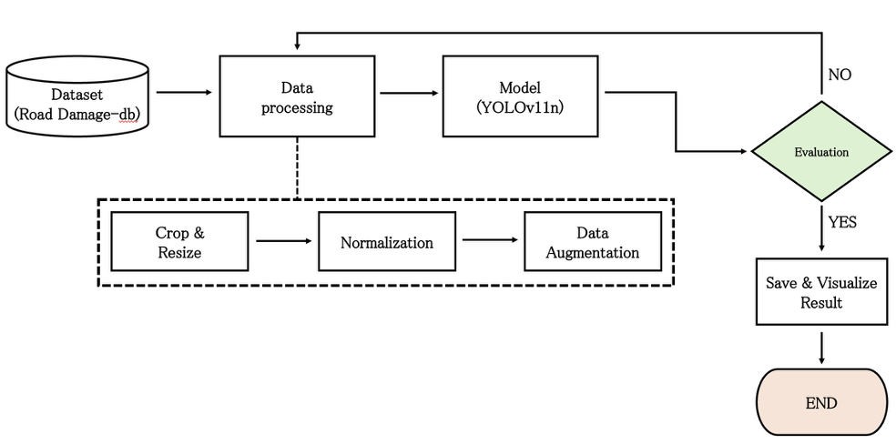

# 블랙박스 주행 환경을 고려한 YOLO11 기반 도로 파손(포트홀/균열) 탐지 고도화 연구


<p align="center"><b>[그림 3] 본 연구의 수행 절차 흐름도 (데이터 전처리 및 YOLOv11n 기반 평가 프로세스)</b></p>

## Installation

To get started, clone the repository and install dependencies:

```bash
!git clone https://github.com/AI-CML/AI_Project.git
%cd AI_Project
!pip install -r requirements.txt

## 📌 프로젝트 소개
본 프로젝트는 차량 블랙박스 주행 영상을 활용하여 도로 상의 파손(포트홀, 미세 균열 등)을 실시간으로 탐지하는 AI 모델 고도화 연구입니다. 단순 이미지 학습을 넘어, 실제 주행 환경(비 오는 날, 맑은 날)에서의 탐지 성능을 검증하고 구조적 오탐지 원인을 분석하여 데이터 중심(Data-Centric)의 해결책을 도출하는 것을 목표로 합니다.

## 💡 주요 연구 및 수행 내용
- **AI 모델 추론 및 추적:** YOLO11 모델 및 Tracking 모드를 활용한 실전 블랙박스 영상 객체 탐지
- **실전 환경 교차 검증:** 우천 시(Flickering 현상) 및 맑은 날(유도선 오탐지) 주행 영상 비교 분석
- **성능 최적화 실험:** Confidence 임계값 조절을 통한 정밀도(Precision)와 재현율(Recall) 트레이드오프 딜레마 검증
- **후처리 필터링:** 특정 클래스(맨홀 등) 오탐지 방지를 위한 추론 코드 내 제외(Classes) 로직 구현
- **해결 방안 도출:** ROI(관심 영역) 크롭 전처리 및 Negative Mining(정상 노면 데이터 재학습) 방향성 제시

## 🛠 사용 기술 및 환경 (Tech Stack)
- **Language:** Python
- **AI Model:** YOLO11
- **Environment:** Google Colab, GitHub

## 👨‍💻 역할 (팀장: 이찬민)
- 주행 영상 기반 YOLO11 객체 추적(Tracking) 테스트 총괄
- 탐지 파라미터(Confidence, Classes 등) 튜닝 및 최적화 코드 적용
- 프로젝트 깃허브 산출물 관리 및 최종 분석 결과 정리
